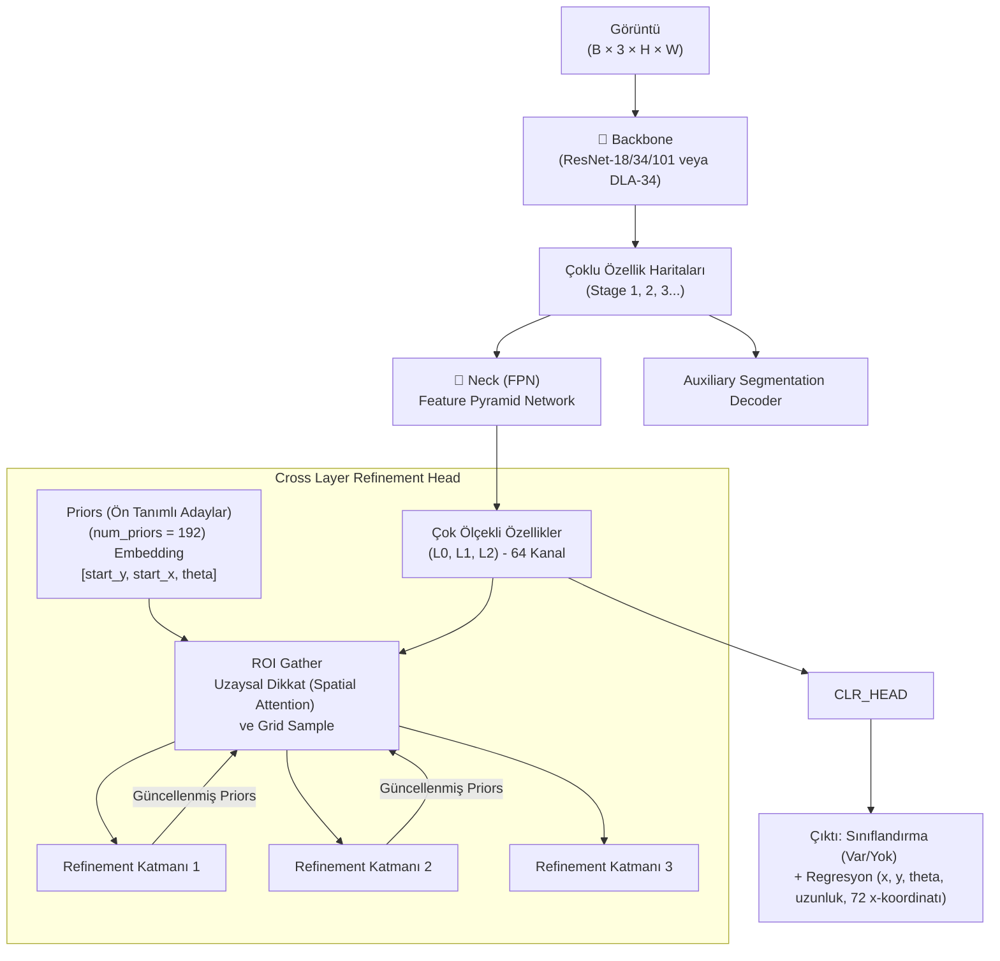

# CLRNet — Detaylı Modül Analizi

> **Cross Layer Refinement Network for Lane Detection** (CVPR 2022)
> CULane, TuSimple ve LLAMAS veri setlerinde SOTA (State-of-the-Art) sonuçlar elde eden, çok katmanlı özellikleri kullanarak şerit tespiti yapan mimari.

---

## Genel Mimari



---

## Katman Katman Modül Analizi

### 1. Giriş Noktaları

| Dosya | Görev |
|-------|-------|
| `main.py` | Eğitim, test ve görselleştirme için argüman parse etme |
| `clrnet/engine/runner.py` | PyTorch tabanlı temel eğitim ve değerlendirme döngüleri |
| `configs/clrnet/` | Model ve veri seti konfigürasyonu |

---

### 2. Config Sistemi — `configs/`

MMCv tipine benzer kalıtımsal (inheritance) Python dosyalarından oluşur. Önemli hiperparametreler (`configs/clrnet/clr_resnet18_culane.py` vs):

| Parametre | Değer | Anlamı |
|-----------|-------|--------|
| `num_points` | 72 | Şeridin yatayda tahmin edileceği y-noktası sayısı |
| `max_lanes` | 4 | Bir görüntüde bulunabilecek maksimum şerit |
| `sample_y` | 589->230 | Çıktı noktalarının dikey koordinatları |
| `num_priors` | 192 | Modelin başlangıç "şerit adayı" sayısı |
| `refine_layers` | 3 | Kaç FPN katmanında arıtma/güncelleme yapılacağı |
| `sample_points` | 36 | Şerit adayı üzerinden özellik toplamak için örneklenen nokta sayısı |
| `fc_hidden_dim` | 64 | ROI Gather ve Head içi gizli MLP boyutu |

---

### 3. Model Giriş Noktası — `models/nets/detector.py`

Model temel olarak 4 ana parçadan oluşur ve her biri confige göre dinamik olarak inşa edilir:
- `backbone`: Özellik çıkarımı.
- `neck`: Özellik piramidi.
- `head`: Gelişmiş şerit tespiti (CLRHead).
- `seg_decoder` (Opsiyonel): Yardımcı segmentasyon.

---

### 4. Backbone — `models/backbones/`

CLRNet esnektir. Kağıtta belirtilen temel backbonelar:
- **ResNet Serisi:** ResNet-18, ResNet-34, ResNet-101. `replace_stride_with_dilation` sıkça kullanılarak üst seviye haritaların boyutu korunur.
- **DLA-34:** Deep Layer Aggregation. Özellikleri çok iyi yoğunlaştırdığı için CULane'de ekstra başarı sağlar.

---

### 5. Position Encoding

Doğrudan LSTR veya DETR'daki gibi açık bir 2D sinüs pozisyon kodlaması (Sine Position Encoding) *kullanmaz*. Çizgilerin konumlarını (x, y, theta) öğrenilebilir statik embeddingler olarak tutar (`PRIOR Embeddings`).

---

### 6. Neck — (FPN) `models/necks/fpn.py`

- **Feature Pyramid Network:** Backbone'un ürettiği 3 farklı boyuttaki özellik haritasını (`in_channels=[128, 256, 512]`) alır.
- Yukarıdan aşağıya upsampling (bilinear) yaparak özellikleri toplar.
- Çıktı olarak 3 adet eşit kanallı (`out_channels=64`) çok ölçekli özellik haritası üretir. Bunlar L0, L1 ve L2 haritaları olarak `refine_layers` adımında sırayla kullanılacaktır.

---

### 7. Prediction Heads — `models/heads/clr_head.py`

Burası modelin asıl vurucu noktasıdır.

- **Prior Embeddings:** Öğrenilebilir `nn.Embedding(192, 3)` nesneleri `start_y`, `start_x`, `theta` bilgisini depolar.
- **Line Pooling & ROI Gather:** Şeritlerin güzergahı boyunca 36 adet noktadan (`grid_sample` ile) 64 boyutlu özellikler toplanır. `ROI Gather`, global özelliklerle bu lokal özellikleri Cross-Attention tarzında (Spatial Attention olarak) melezler.
- **Cross Layer Refinement:** Bu işlem FPN haritaları L0, L1 ve L2 üzerinde ardışık olarak 3 defa tekrarlanır. Her birinde şeridin sınıfı ve offsetleri daraltılarak prior'lar eğilip bükülür.

**Şerit Tahmin Formatı:** `[Sınıf Skoru, start_y, start_x, theta, length, 72 adet x-noktası]`

---

### 8. Loss Sistemi — `models/losses/`

Dört farklı kayıp hesaplanır ve eşleşmeler maliyete göre (Hungarian Matching türevi veya dinamik atama) yapılır:
- **`cls_loss` (Sınıflandırma):** `FocalLoss(alpha=0.25, gamma=2)`
- **`reg_xytl_loss` (Başlangıç ve Açı):** PyTorch `F.smooth_l1_loss`.
- **`iou_loss` (Line IoU Loss):** Modelin en büyük icatlarından. Olası şerit çizgilerini dikdörtgen gibi varsayıp 1 Boyutlu Kesişim/Birleşim hesabı yapar. `liou_loss` denir.
- **`seg_loss` (Yardımcı Segmentasyon):** Sadece eğitimde kullanılan, en alt özellik haritasıyla maske (Cross-Entropy) kaybı.

---

### 9. Dataset Pipeline — `clrnet/datasets/`

- CULane, TuSimple, LLAMAS verileri için spesifik Data Loader sınıfları barındırır.
- Görseller, çoklu küçültme ve flip/rotasyon augmentasyon işlemlerinden geçer.
- Geleneksel maske segmentasyonu veri setlerindeki koordinatlar, 72 x-noktasına denk gelecek şekilde y-sampling listesine (Örn: 589'dan 230'a) iz düşürülür.

---

### 10. Training Infrastructure — `clrnet/engine/`

PyTorch'un standart `DistributedDataParallel` veya tek GPU döngülerini sarar. Optimize edici genellikle `AdamW`'dur ve `CosineAnnealingLR` (Kosinüs azalması) schedule kullanılır. Ağırlıklar (checkpoints) belirli iterasyonlarda otomatik kaydedilir.

---

### 11. Evaluation Pipeline — `clrnet/utils/`

- CULane için tahminleri argümandaki test klasörüne resmi `.lines.txt` formatında yazar ve resmi C++ değerlendiricisine yollar.
- Tahminlerden elde edilen her `[72 nokta]` dizisi, güven skoruna (`cls_logits`) ve NMS (Non-Maximum Suppression) eşik değerlerine bakılarak filtrelenir.

---

## Tüm Veri Akışı

```
Görüntü (B × 3 × 320 × 800)
  → Backbone (ResNet-18 vb.) ....................... Stage 1, 2, 3 Çıktıları
  → FPN Neck ....................................... L0, L1, L2 Haritaları (B, 64, H, W)
  
  -- Prior İlklendirme: 192 Aday Şerit Çizgisi Başlat --
  
  Döngü (Katman i=0,1,2 için):
    → Prior'lar üzerinden Line Pooling (36 nokta) .. (B, 192, 36, 64)
    → ROI Gather (Spatial Attention)
    → Linear Heads: Sınıflandırma ve Regresyon tahminleri
    → Prior'ları Regresyon offsetleri ile Güncelle
  
  ↓ Son Katman Çıktısı (B, 192, k)
  → Sınıf Tahmini (Var/Yok)
  → x, y, theta, length ve 72 x-ofseti
  
[Eğitim]  Matching (IoU + L1 maliyetine göre) → Loss (Focal + LineIoU + SmoothL1) → backward
[Test]    Sınıf Skoru barajı (örn. 0.5) → NMS → x, y koordinat listesi (72 noktaya göre) → .lines.txt yaz
```
