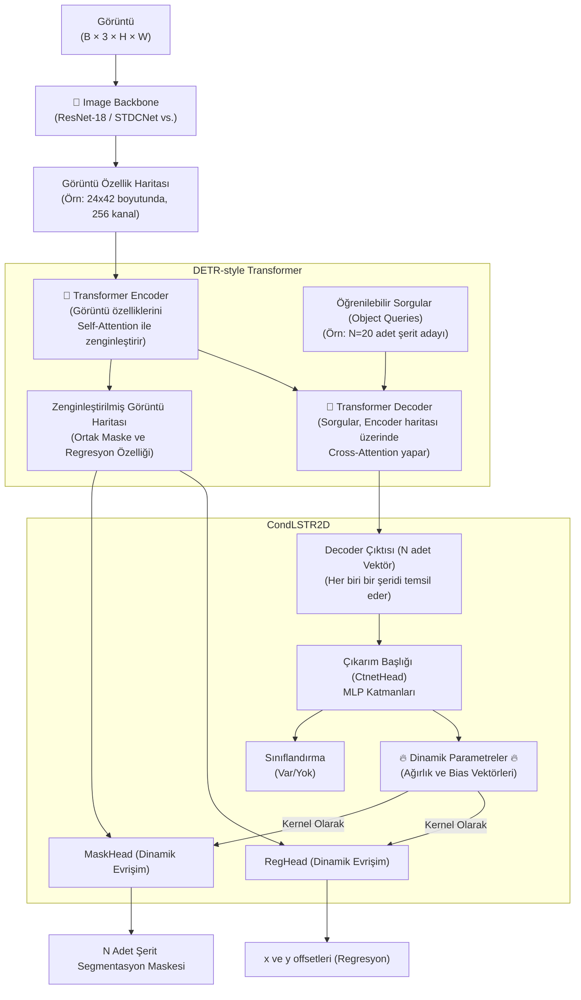

# CondLSTR — Detaylı Modül Analizi

> **Generating Dynamic Kernels via Transformers for Lane Detection** (CondLSTR)
> LSTR'ın Transformer-tabanlı "object query" mantığı ile CondLaneNet'in "Dinamik Koşullu Evrişim" (Conditional Convolution) mantığını muazzam bir şekilde harmanlayan melez model.

---

## Genel Mimari



---

## Katman Katman Modül Analizi

### 1. Giriş Noktaları

| Dosya | Görev |
|-------|-------|
| `tools/train.py` | PyTorch eğitim döngüsü ve hiperparametre ayarları |
| `tools/evaluation.py` | Test sonuçlarını değerlendirme |
| `modeling/models/` | Ağ katmanları, omurga ve dedektör modüllerinin bulunduğu ana klasör |

---

### 2. Config Sistemi

Spesifik bir YAML veya Json bazlı tek merkezli framework kullanmak yerine Python `argparse` ve iç içe verilmiş python argümanları ile çalışır.
**Kritik Değerler**:
- `num_queries` (örn: 20 veya 7): Transformer Decoder'ına verilen şerit adayı bağlamı sayısı.
- `mask_channels`: Dinamik özellik için çıkış kanal boyutu.
- `enc_layers` ve `dec_layers`: Transformer Mimarisi (örn: 6 katmanlı Encoder, 6 katmanlı Decoder veya LSTR formatındaki gibi daha hafif).

---

### 3. Model Giriş Noktası — `modeling/models/lane/cond_lstr_2d_res18.py`

`CondLSTR2DRes18` ana modeli tanımlar:
- `self.img_backbone` (Görüntü CNN omurgası)
- `self.det_backbone` (Transformer encoder-decoder modülü)
- `self.detector` (Dinamik param üreten CondLSTR2D Dedektörü)

İleri besleme (forward) adımı tamamen bu blokların sırayla çalıştırılmasından ibarettir.

---

### 4. Backbone — `modeling/models/backbones/`

ResNet (ResNet-18 vb.) veya STDCNet gibi standart CNN omurgaları kullanılarak 1/8, 1/16, 1/32 oranında küçültülmüş pikselsel özellik (feature) haritaları çıkarılır.

---

### 5. Position Encoding — `models/backbones/transformer/transformer.py`

LSTR ve DETR serisindeki klasik **Sine (Sinüs) 2D Konumsal Kodlamayı** kullanır. 
Görüntüden çıkan özellik haritasındaki her piksele X ve Y ekseni sinüzoidal dalgalarıyla oluşturulmuş özellikler eklenerek Transformer'a konum fikri aşılanır.

---

### 6. Transformer (Özellik Zenginleştirici) — `models/backbones/transformer/`

DETR'nin kalbini alır:
- **Encoder:** Görüntü haritasını tek boyutlu diziye flattens eder. Katman katman Self-Attention yaparak pikseller arası ilişkiyi zirveye taşır. Buradan çıkan zenginleştirilmiş harita (`ENCODER_OUT`), ileride maske çıkartılmak için saklanır.
- **Decoder:** `N` adet sıfır veya rastgele ilklendirilmiş sorgu (Object Query), zengin harita üzerinden Cross-Attention yapar ve şeritlerin varlıklarına dair N adet güçlü vektöre (`DEC_OUT`) evrilir.

---

### 7. Prediction Heads — `models/detectors/lane/cond_lstr_2d/cond_lstr_2d.py`

Bu kısım CondLaneNet mantığıdır. Üç kafası vardır:
- **CtnetHead:** Decoder'dan çıkan N adet vektörü MLP katmanlarıyla ezip hem Sınıflandırma (Var/Yok) Skoru verir, hem de **Dinamik Evrişim Ağırlıkları (Filter Parameters)** dökümü yapar.
- **MaskHead:** N adet ağırlığı alarak, Encoder'dan çıkan ana harita üzerinde `torch.bmm` ile nokta pikselli dinamik konvolüsyon (1x1) uygular ve `N` adet muazzam keskin Segmentasyon Maskesi verir.
- **RegHead:** Aynı dinamik konvolüsyon mantığıyla x,y offsetleri ve uzunluklar hesaplanarak y-referanslı ince ayar yapılır.

---

### 8. Loss Sistemi

`matcher.py` kullanılarak tahminler ve Ground Truth (GT) şeritler arasında `Bipartite Hungarian Matching` (1'e 1 optimal eşleştirme) yapılır. Eşleştirilen şeritler üzerinde:
- **`loss_ce`**: Var/Yok için CrossEntropy.
- **`loss_mask` / `loss_dice`**: MaskHead'den çıkan pikselsel maskelerin Dice Loss ve Focal Loss hesaplaması.
- **`loss_lines`**: Tahmin edilen offsetler üzerinden L1 uzaklık (MAE) hesaplanır.

---

### 9. Dataset Pipeline

CULane gibi veri setlerini maskeler ve y-referanslı x-noktaları olarak parseller. LSTR gibi tamamen regresyona yönelik değil, aynı zamanda CondLaneNet gibi maske odaklı bir veri hazırlığına sahiptir.

---

### 10. Training Infrastructure

Tek çekirdek veya DDP (DistributedDataParallel) PyTorch omurgası kullanılır. `AdamW` optimizasyonu popülerdir. Eğitimin bir kısmından sonra Transformer ve CNN backbonelarına ince ayar (fine-tuning) için farklı learning rate verilebilir.

---

### 11. Evaluation Pipeline

Tahmin edilen piksel maskeleri (Dinamik mask head'den çıkan ön plan pikselleri) ve X,Y offsetleri birleştirilerek polinom/doğrusal çizgilere dönüştürülür. Çıkan sonuç (points dizileri) `.lines.txt` formatında CULane C++ evaluation scriptlerine tabi tutulur.

---

## Tüm Veri Akışı

```
Görüntü (3×H×W)
  → Image Backbone (Örn. ResNet-18) ................. C Kanal, H/32, W/32 Özellik Haritası
  → Transformer Encoder (Self-Attention) ............ Zenginleştirilmiş Görüntü Haritası
  │                                                   (Bu harita maske üretim kanalına yollanır)
  │
  → Öğrenilebilir N Adet Sorgu (Queries)
  → Transformer Decoder (Cross-Attention) ........... N Adet "Şerit Özellik" Vektörü
  ↓
  ┌── Sınıf Çıktısı (Var / Yok skoru)
  └── CtnetHead (MLP) ............................... Dinamik CNN Ağırlıkları (Params)
  ↓
Zenginleştirilmiş Görüntü Haritası  ✕ (Dinamik Ağırlıklar)
  │
  ├─> MaskHead (bmm) ................................ N adet Pikselsel Şerit Maskesi
  └─> RegHead (bmm) ................................. N adet x, y Regresyon Ofseti
  ↓
[Eğitim] Hungarian Matching → Mask/Dice Loss + L1 Regression Loss + CrossEntropy
[Test] Maskelerden ve ofsetlerden koordinatları çıkar → line noktalarını dosyaya yaz → Evaluate
```
