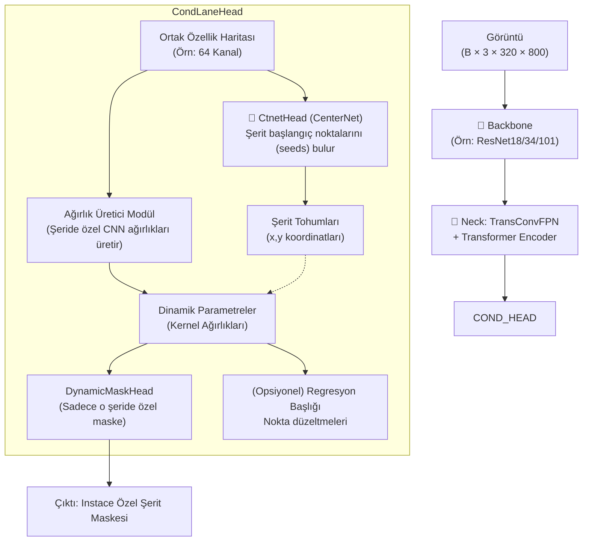

# CondLaneNet — Detaylı Modül Analizi

> **CondLaneNet: a Top-to-down Conditional Macroscopic Framework for Exploring Shape Priors in Lane Detection** (ICCV 2021)
> LSTR analizinde uyguladığımız 10 maddeli formata birebir sadık kalınarak hazırlanmıştır.

---

## Genel Mimari



---

## Katman Katman Modül Analizi

### 1. Giriş Noktaları

| Dosya | Görev |
|-------|-------|
| `tools/train.py` | OpenMMLab (MMDet) tabanlı eğitim döngüsü başlatıcı |
| `tools/test.py` | Arayüz ve Evaluation için test betiği |
| `configs/condlanenet/...` | Tüm model hiperparametre ve yapılandırma dosyaları |

---

### 2. Config Sistemi — `configs/condlanenet/culane/culane_small_train.py`

Standart **MMDetection Config** (Python dict tabanlı) sistemini kullanır. JSON yerine Python dosyası okunur. Orijinal LSTR config sisteminden çok daha modülerdir.

**CULane Small için kritik değerler**:

| Parametre | Değer | Anlamı |
|-----------|-------|--------|
| `backbone` | ResNet18 | Temel özellik çıkarıcı ağ |
| `neck.type` | `TransConvFPN` | İçinde Transformer barındıran FPN |
| `neck.trans_cfg` | `in_dim=512`, `attn_out=64` | Transformer katman parametreleri |
| `head.type` | `CondLaneHead` | Tohum tabanlı ana tespit başlığı |
| `out_scale` | 8 (mask), 16 (hm) | Çıktıların downsample oranları |
| `loss_weights` | `hm:1`, `kps:0.4`, `row:1` | Kayıp fonksiyonu çarpanları |

---

### 3. Model Giriş Noktası — `mmdet/models/detectors/condlanenet.py`

Model, MMDetection'ın `SingleStageDetector` sınıfından türer. Tüm mimariyi (Backbone -> Neck -> Head) birbirine bağlar.

```python
class CondLaneNet(SingleStageDetector):
    # forward_train() ve forward_test() fonksiyonları ile
    # resmin önce backbone'a, sonra neck'e ve son olarak 
    # bbox_head (CondLaneHead) katmanına gitmesini sağlar.
```

---

### 4. Backbone — `mmdet/models/backbones/` (Genellikle ResNet)

LSTR'ın aksine manuel bir mini-resnet yazmak yerine, torchvision'ın veya MMDet'in hazır **ResNet** varyantlarını (ResNet18, 34, 101 vb.) kullanır. Çıktı olarak 4 aşamanın (stage) `[C2, C3, C4, C5]` özellik haritalarını verir.

---

### 5. Position Encoding — `mmdet/models/necks/trans_fpn.py`

LSTR'de olduğu gibi **Sinusoidal Position Encoding (Sine)** kullanır:
- Transformer'a girmeden hemen önce, `PositionEmbeddingSine` sınıfı ile en derin özellik haritasına x ve y koordinatlarını kodlar.

---

### 6. Transformer (Neck / FPN) — `TransConvFPN` Modülü

Orijinal LSTR sadece özellik çıkarıp Transformer'a atarken, CondLaneNet farklı seviyelerdeki özellikleri birleştirmek için FPN (Feature Pyramid Network) kullanır, fakat içine Transformer gömer:

#### TransConvEncoderModule
```
En Derin Harita (ResNet C5) ──+──> Self-Attention Dönüşümü
      (İsteğe bağlı pozisyon) │
```
- Bu kısım, şeritler gibi global (tüm resmi kaplayan) yapıların FPN'e girmeden önce küresel bağlamı (global context) anlamasını sağlar.
- Daha sonra Transformer'dan geçen bu harita, standart FPN yapısıyla yukarıdaki çözünürlüklere dağıtılır.

---

### 7. Prediction Heads — `condlanenet_head.py`

Modelin kalbi olan yapıdır. Paralel değil, **şartlı (conditional)** çalışır:

**A. CtnetHead (CenterNet Head)**
- Şeritlerin başlangıç noktalarını (seed) tahmin eder (`hm` - heatmap). Kök noktayı bulduğunda "Burada bir şerit var" der.

**B. Parametre Üretici (MLP / Conv)**
- Bulunan tohum noktasındaki (örneğin x=150, y=300 piksellerindeki) özellik haritasını okur.
- O değere bakarak anında yeni bir CNN ağırlığı oluşturur (`mask_params`, `reg_params`).

**C. DynamicMaskHead**
- Pytorch'taki standart ağırlıklar yerine, üstte o an üretilen dinamik kernel'leri kullanarak Evrişim (Convolution) yapar. Sadece tek bir şeridi boyar.

---

### 8. Loss Sistemi — `mmdet/models/losses/condlaneloss.py`

LSTR algoritmasında Hungarian Matching varken CondLaneNet farklı kayıplar birleştirir:

- **`hm_weight` (Heatmap Loss):** Focal Loss mantığıyla CenterNet tohum bulma doğruluğu.
- **`row_weight` (Row Loss):** Şeridin yatay koordinatlarını (satır bazlı) maskeleyen sınıflandırma kaybı (Cross Entropy).
- **`reg_weight` (Regression Loss):** Sub-pixel hassasiyeti için L1 varyantı kayıp. Kaba maskelemeyi düzeltir.

*(CondLaneNet eşleştirme gerektirmez, çünkü her tohum doğrudan kendi şeridini yaratır).*

---

### 9. Dataset Pipeline — `mmdet/datasets/culane_dataset.py` & `pipelines/`

MMDetection'ın güçlü veri artırma boru hattını (`albumentation`, `Compose`) kullanır:
- **`CollectLane`**: Görüntüleri standart formata (`img_shape`, `gt_hm`, `gt_masks`) çevirir. Ground truth (GT) verisi maskelere, tohumlara ve koordinat ofsetlerine dönüştürülüp hafızaya yüklenir.

---

### 10. Training Infrastructure — `tools/train.py`

PyTorch'un temel eğitim döngüsünü elle yazmak yerine (LSTR gibi), **MMCV Runner** kullanır:
- `OptimizerHook`, `IterTimerHook`, `CheckpointHook` gibi yapı taşlarıyla otomatik checkpoint alma, logger (TextLoggerHook) ayarlama işlemlerini yapar.
- Çoklu GPU (DDP - Distributed Data Parallel) eğitimine doğrudan (bash scriptleri ile) uyumludur.

---

### 11. Evaluation Pipeline — `tools/test.py` -> `CondLanePostProcessor`

**Post Processing & NMS:**
- `condlanenet_head.py` içindeki `CondLanePostProcessor` sınıfı; önce Heatmap (tohum) haritası üzerinde standart bir Max-Pooling yaparak NMS (aynı tohumları eleme) uygular.
- Geri kalan tohumlar maskelere çevrilip y koordinatları boyunca satır satır x koordinatları okunarak şerit (polyline) formatında yazdırılır. OpenCV tabanlı CULane F-measure C++ değerlendiricisine verilir.

---

## Tüm Veri Akışı

```
Görüntü (320 × 800 × 3)
  → Backbone (ResNet18) ............................ [C2, C3, C4, C5 özellikleri]
  → TransConvFPN (Neck)
      ├─ C5 üzerine Transformer (Self Attention) .... (Bağlam algısı)
      └─ FPN ile haritalar birleştirilir
  → Head (CondLaneHead)
      ├─ CtnetHead → Sıcaklık Haritası (Heatmap) .... [Tohum Noktaları Bulunur (x,y)]
      └─ Parametre Çıkarıcı → Bu tohumlara ait dinamik Convolution filtreleri üretir.
  ↓
  (Her bir tohum noktası için döngü başlar)
  → DynamicMaskHead ................................ [Tohuma özel dinamik Conv2D uygulanır]
  → Çıktı Maskesi .................................. [Sadece 1 şeridin maskesi]
  ↓
[Post-Process] Maskeden argmax ile her satırdaki X noktası okunur.
[Test]         x,y koordinatları .lines.txt olarak dışarı aktarılıp eval binary ile ölçülür.
```
