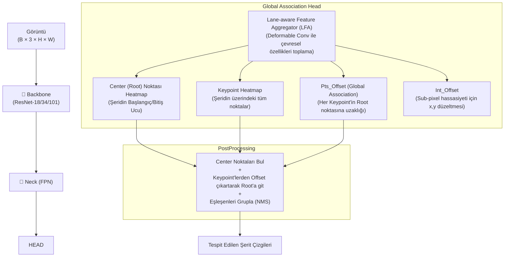

# GANet — Detaylı Modül Analizi

> **A Keypoint-based Global Association Network for Lane Detection** (CVPR 2022)
> Şerit tespitini "nokta nokta ilerleme" yerine, "her noktanın doğrudan şeridin başlangıç noktasına (kök) olan uzaklığını (offset) tahmin etmesi" şeklinde çözen, oldukça yenilikçi ve paralel çalışabilen bir mimari.

---

## Genel Mimari



---

## Katman Katman Modül Analizi

### 1. Giriş Noktaları

| Dosya | Görev |
|-------|-------|
| `tools/train.py` | PyTorch MMDetection altyapılı eğitim döngüsü |
| `tools/test.py` | Çıkarım (Inference) ve model evaluate betiği |
| `configs/ganet/` | Eğitim için tüm konfigürasyon veri yapıları |

---

### 2. Config Sistemi — `configs/ganet/`

MMLab / MMDetection standart Config mirası (`_base_ = [...]`) yapısını kullanır.
Önemli konfigler:
- `num_classes`: Heatmap kanalları için şerit sınıfı (1 veya daha çoklu sınıflar).
- LFA boyutu ve Deformable Convolution pencere büyüklükleri.

---

### 3. Model Giriş Noktası — `models/detectors/ganet.py`

`GANet` Sınıfı `SingleStageDetector` tabanlıdır. `forward_train` ve `forward_test` işlevleri üzerinden, Backbone'dan alıp Head'e göndererek doğrudan maske/heatmap tahminlerini yürütür ve loss hesaplar.

---

### 4. Backbone

Klasik **ResNet** serisi (örn. ResNet-34) veya **HRNet** kullanılır. Özellikler farklı `stage` çıkışlarından `FPN`'e aktarılmak üzere toplanır.

---

### 5. Position Encoding

Açık (Explicit) bir 2D sinüs kodlaması barındırmaz. Konumsal harita (heatmap) mantığına dayandığı için piksel lokasyonları ve Deformable Conv operasyonları üzerinden konumsal anlayışı CNN türevi örtülü (implicit) yollarla kavrar.

---

### 6. Neck (FPN / Feature Aggregator) — `models/dense_heads/lanepoints_conv.py`

- ResNet'ten çıkan çok katmanlı özellikler FPN (Feature Pyramid Network) ile birleştirilir.
- **LFA (Lane-aware Feature Aggregator):** Şeritler çok ince yapılı oldukları için çevresel bağlama aşırı ihtiyaç duyarlar. GANet, standart evrişim yerine **Deformable Convolution** kullanır. Cihaz kendi kendine "şeritlerin uzandığı doğrultudaki" çevresel piksellere ağırlık vererek filtre şeklini büker. Zengin özellikler elde edilir.

---

### 7. Prediction Heads — `models/dense_heads/ganet_head.py`

FPN ve LFA haritalarından 4 ayrı çıktı üretilir, ve regresyon/polinom denklemi gibi zorlayıcı hiçbir işlem yoktur. Sadece matris çıktılarıdır:
1. `cpts_hm` (Center/Root Heatmap): Şeridin en alttan "başladığı" nokta (kök) ihtimal haritası.
2. `kpts_hm` (Key Points Heatmap): Piksellerin şerite ait olma ihtimallerini taşıyan maske.
3. `pts_offset`: En kritik vektörel çıktıdır. O piksel şeride aitse, köküne (center) doğru dx ve dy olarak ne kadar uzağa fırlatılması gerektiğini tahmin eder.
4. `int_offset`: Sub-pixel küsurat düzeltme x ve y haritası.

---

### 8. Loss Sistemi

Kayıplar LFA haritalarından hesaplanır.
- **Heatmap Kayıpları:** Gaussian ile bulanıklaştırılmış ground truth Heatmap'ler ile Cpts ve Kpts tahminleri arasında Focal Loss (Sınıf dengesizliğini kırar).
- **Offset Kayıpları:** Pts_offset ve Int_offset arasındaki mesafe farkları L1 Loss ile (yalnızca şerit pikselleri olan `positive` pozisyonlar için) maksimize edilmek yerine minimize edilir.

---

### 9. Dataset Pipeline

Heatmap mantığında olduğu için CornerNet ve CenterNet yaklaşımlarına benzer formatta veriler üretilir. GT şerit çizgilerini önce kalınlaştırılmış bir maskeye dönüştürür, ardından şeridin alt ucunu kök olarak belirleyip her pikselin o köke olan (dx, dy) vektörünü `pts_offset` GT'si olarak `.npy` formatlarında belleğe çıkarır.

---

### 10. Training Infrastructure

MMCv `Runner` modülünü kullanır. Adam optimizer ile başlatılır. PyTorch Native AMP (Automatic Mixed Precision) sayesinde devasa Heatmap'ler eğitilirken RAM tüketimini dizginler. Aşamalı öğrenme oranı planlamaları yapar.

---

### 11. Evaluation Pipeline

MMLab tabanında çıkarım çalışır.
1. `cpts_hm` haritasından kökler Max-Pooling tepeleri olarak bulunur.
2. `kpts_hm` haritasından binlerce geçerli nokta alınır.
3. Tüm geçerli noktaların `pts_offset`'i kendi xy'lerinden çıkarılır, hepsi sanal bir noktaya zıplar.
4. Çıkan o sanal nokta, Köklerden (`cpts_hm`) birinin yakınına düşmüşse o noktaya mensup olur. Eşleşmeyen şerit parçaları filtrelenerek elenir. Kümelenen noktalar sıvalanıp `.lines.txt` listelerine dönüştürülüp resmi CULane/TuSimple değerlendirme metriklerine fırlatılır.

---

## Tüm Veri Akışı

```
Görüntü (B × 3 × H × W)
  → Backbone (ResNet) ........................................ Multiscale Çıktılar
  → FPN (Özellikleri Birleştir) .............................. (B, 64, H/4, W/4)
  → LFA (Deformable Convolution - Şeritleri çevreyle sar) .... Daha zengin lokal Features
  ↓
  ┌── Center Head (Heatmap) ................................ (B, 1, H/4, W/4)
  ├── Keypoint Head (Heatmap) .............................. (B, 1, H/4, W/4)
  ├── Pts Offset Head (x,y Regresyon) ...................... (B, 2, H/4, W/4)
  └── Int Offset Head (Küsurat x,y Reg) .................... (B, 2, H/4, W/4)
  ↓
[Eğitim] Kök ve Nokta Heatmap'leri Focal Loss ile cezalandır, Offset'leri şerit içi L1 Loss ile.
[Test]   Kök noktalarını bul (Center) → Keypointleri Offsetlerine göre Kök'e kaydır → 
         Kökünün etrafında kümelenen pikselleri Grupla (Clustering) → Koordinata dök.
```
