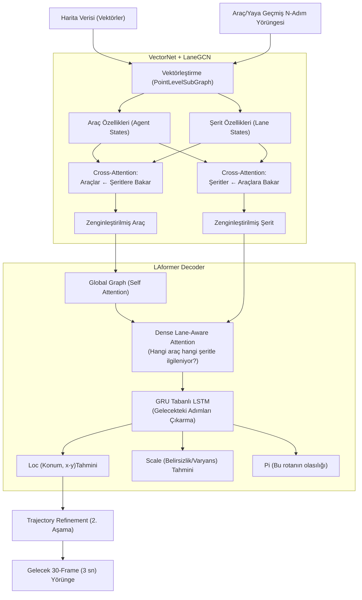

# LAformer — Detaylı Modül Analizi

> **LAformer: Trajectory Prediction for Autonomous Driving with Lane-Aware Scene Constraints** (CVPR 2024)
> Önceki incelediğimiz modellerden (LSTR, CLRNet vb.) farklı olarak bu model bir **"Şerit Tespit" (Lane Detection)** modeli değil, bir **"Yörünge Tahmini" (Trajectory Prediction)** modelidir. Yani şeritleri bulmak yerine, bulunan şeritleri ve diğer araçların hareketlerini baz alarak gelecekteki rotaları tahmin eder.

---

## Genel Mimari



---

## Katman Katman Modül Analizi

### 1. Giriş Noktaları

| Dosya | Görev |
|-------|-------|
| `eval.py` / `train.py` | Model eğitimi ve NuScenes/Argoverse tabanlı yörünge testi giriş noktaları. |
| `src/modeling/` | VectorNet ve Decoder kısımlarının mimari inşaları. |

---

### 2. Config Sistemi

Spesifik bir config frameworkü yerine doğrudan model yükleme (argparse) argumanlarıyla hyperparametre kurar.
- Girdi Geçmiş Zamanı (history): Son N framelik araç rotası (Örn: 2 saniye)
- Tahmin Edilecek Gelecek (future): M framelik çıkış rotası (Örn: 3 saniye)
- Özellik Boyutu: 128 Kanal vb. boyutlarda Agent'lar modellenir.

---

### 3. Model Giriş Noktası — `models/` (Ana Akış)

Pikselden (resimden) beslenmedikleri için bir CNN girişi yoktur. Zaten çıkarılmış veya sistemlerden toplanmış poligon (polyline) dizi koordinatları alıp, bunları Graf ve VectorNet ağlarına sevk eder.

---

### 4. Backbone (Vektör Ağı) — `models/vectornet.py`

Dünyayı pikseller (CNN) olarak değil, Vektörler dizisi olarak algılayan omurgadır.
- `PointLevelSubGraph`: Her bir şerit çizgisini ve aracın geçmiş hareketlerini (x,y koordinatları), ardışık MLP ve GRU katmanlarından geçirerek tek bir d-boyutlu gömme (embedding) vektörüne dönüştürür. Görüntüyü değil Graf noktalarını temsil eder.

---

### 5. Position Encoding

Koordinat sisteminin bizzat üzerinde çalışıldığı için, noktaların kendisi (ve aralarındaki mesafe rölatif vektörleri) özelliklerin bir parçasıdır. Girdi düğümlerinin üzerine doğrudan vektör özellik kodlamaları yapılarak mekansal uzay tanımlanır.

---

### 6. LaneGCN / Çapraz İletişim (Neck)

Şeritler ile Araçların Vektörleri üretildikten sonra:
- İki farklı (Agent-to-Lane ve Lane-to-Agent) Transformer yapısı mevcuttur. Araçlar hareket ederken hangi şerit çizgilerinden etkilendiklerini (Kavşaktayım o yüzden çizgiye göre durmalıyım vb.) Cross-Attention ile öğrenirler ve birleştirilirler.

---

### 7. Prediction Heads — `models/laplace_decoder.py`

Öğrenilmiş yörünge/şerit özelliklerini alıp geleceği tahmin eder:
- Tüm araç özellikleri kendi aralarında `GlobalGraph` (Self-Attention) ile iletişim kurar. Çarpışmadan kaçınma stratejilerini (Agent-to-Agent) anlarlar.
- **Dense Lane-Aware Attention**: Araçlar (Agents), gelecekte sadece "kendileriyle en ilgili" şeritlere odaklanmasını sağlar.
- Son tahminler bir **GRU** bloğuna sürülür ve zaman serisi (sıradaki x-y tahminleri) sıralanır.

---

### 8. Loss Sistemi

Sıradan Modeller MSE (L2) loss kullanırken LAformer, **Laplace NLL (Negative Log Likelihood)** kullanır.
- `loc` : Çıkarılmak istenen rotanın (konum x,y) beklenen yerini verir.
- `scale` : O tahmindeki belirsizliği (Varyans/Dağılım) verir. 
Ayrıca sistem Multimodal (Çoklu olasılıklı yörüngeler) çalışır, en olası "6 yörünge" çıkarılıp bunlardan en iyi olana (vektörel ihtimale) göre sınıflandırma kaybı da hesaplanır.

---

### 9. Dataset Pipeline

Argoverse, NuScenes gibi Otonom sürüş büyük veri setlerini destekler. Araçların LIDAR / GPS kayıtlarından yola çıkılarak oluşturulmuş olan Şerit Grafikleri ve HD harita düğümleri Tensor'lara sarılır. Resim kırpmaları vs. yer almaz. İşlem saf Graf işlemleridir.

---

### 10. Training Infrastructure

GPU üzerinden Vector işlemleri DDP (DistributedDataParallel) tabanlı standart bir PyTorch döngüsüyle çalıştırılır. Batch'lerin (Graf boyutları farklı olabileceği için) esnek matris boyutlarını kaldırmak maksadıyla Maskeli Matris (Padding) Tensor hesaplamaları yoğun olarak yapılır.

---

### 11. Evaluation Pipeline

Tahmin edilen Gelecek Yörünge X-Y serileri Ground Truth test yörüngesi y-x noktalarıyla karşılaştırılır.
Metrikler:
- **ADE (Average Displacement Error):** Tüm tahmini yol botu ortalama sapma.
- **FDE (Final Displacement Error):** 3 saniye sonraki "son" noktadaki merkeze olan hata (metre cinsinden). Çoklu olasılıklardan min(FDE) vs max.

---

## Tüm Veri Akışı

```
(Harita Şerit Çizgileri - XY Düğümü) 
  → VectorNet (PointLevelSubGraph) .............. Şerit Vektörü Özellikleri (Lane States)
(Diğer Araçların Geçmiş Rotaları - XY)
  → VectorNet (PointLevelSubGraph) .............. Araç Vektörü Özellikleri (Agent States)
  ↓
  [LaneGCN Çaprazlama]
  → Şeritlerin Araçlardan etkilendiği Çapraz Dikkat
  → Araçların Şeritlerden etkilendiği Çapraz Dikkat
  ↓
  [Laplace Decoder]
  → Zenginleşmiş Araç Özellikleri + Ego Araç → Global Self-Attention (Çarpışma Engelleme)
  → Zenginleşmiş Şeritler → Araçlara Dense Lane-Aware Attention ile etki etsin.
  ↓
  [GRU Blok]
  → Gelecekteki M Tane Frame için Tahminler Yürüt:
  ├── loc (X-Y Ortalama Tahmin Noktası)
  ├── scale (Eminlik / Varyans Dağılımı)
  └── pi (Senaryonun / Yörüngenin olasılık skoru)
  ↓
[Eğitim]  Negatif Log Laplace Olasılık Loss ile belirsizliği optimize et.
[Test]    Çıkan rotaları (min ADE/FDE bazında) Otonom sistem direksiyonuna gönder.
```
