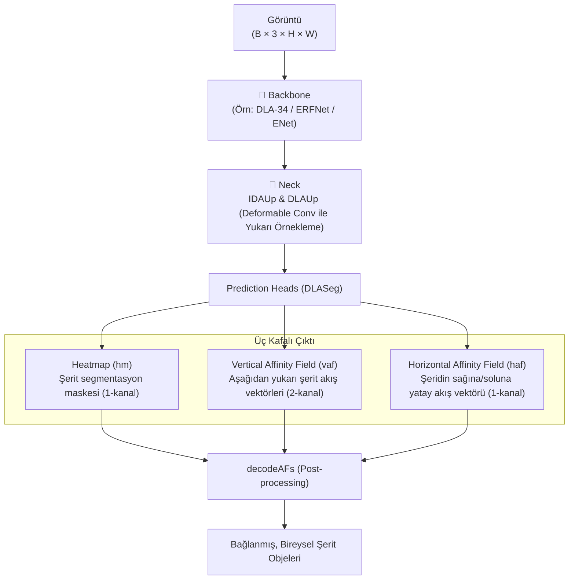

# LaneAF — Detaylı Modül Analizi

> **LaneAF: Robust Multi-Lane Detection with Affinity Fields** (IEEE RA-L 2021)
> Şerit takibini OpenPose'dan ilham alarak "Affinity Fields" (Çekim Alanları) ile çözen, baştan aşağı "Segmentation + Clustering" tabanlı bir CNN modeli.

---

## Genel Mimari



---

## Katman Katman Modül Analizi

### 1. Giriş Noktaları

| Dosya | Görev |
|-------|-------|
| `train_culane.py` | PyTorch tabanlı eğitim döngüsü (CULane veri seti için) |
| `infer_culane.py` | Eğitilmiş model ile test verisinde çıktı üretme |
| `utils/affinity_fields.py` | VAF ve HAF vektörlerinin üretilmesi ve maske ile gruplanması |

---

### 2. Config Sistemi — (Argparse Tabanlı)

LSTR (JSON) veya CondLaneNet (MMDet py-config) gibi hiyerarşik bir config dosyası tutmuyor. Ayarları tamamen `argparse` kullanarak direkt komut satırından alır.
Eğitim başladığında ayarları `experiments/culane/TARIH/config.json` dosyasına dökümü alınarak kaydeder.

**Örnek ayarlar**:
- `--backbone`: `dla34`, `erfnet`, `enet`
- `--loss-type`: `focal`, `bce`, `wbce` (Ağırlıklı BCE)
- `--batch-size`: 8

---

### 3. Model Giriş Noktası — `models/dla/pose_dla_dcn.py`

CenterNet kod tabanından uyarlanan `DLASeg` sınıfı temel modeli oluşturur.
- Model girişi `get_pose_net` modülü kullanılarak yapılır. Bu modüle, hangi başlıkların üretileceği parametre olarak geçer:
  `heads = {'hm': 1, 'vaf': 2, 'haf': 1}`

---

### 4. Backbone — (DLA-34 / Deep Layer Aggregation)

Model varsayılan olarak **DLA-34** (ImageNet'ten transfer öğrenimiyle) kullanır.
ResNet'ten farkı, özellikleri sadece aşağı indirip en sonda bağlamak yerine, aşamalı olarak ağaç ("Tree") mimarisi ile ara katmanlarda "Aggregating" (birçok konumsal veriyi bir araya getirme) işlemini uygulamasıdır (`Root`, `Tree` sınıfları). 

---

### 5. Position Encoding — YOK

LaneAF, LSTR vs. gibi Transformer tabanlı DEĞİLDİR. Konumsal bilgi (Position Encoding) katmanları İÇERMEZ. Saf evrişim (Convolution) ağı mantığıyla ilerler. Tüm şerit koordinatları maskelerin uzaysal yerleşimiyle (spatial resolution) belirlenir.

---

### 6. Neck & UpSampling — (IDAUp ve DLAUp)

Model, özellik haritasını Backbone ile düşürdükten sonra tekrar "yüksek çözünürlüğe" çıkarmak için `IDAUp` ve `DLAUp` modüllerini çalıştırır.
Bunu yaparken **DCNv2 (Deformable Convolutional Networks)** katmanlarını kullanır. Tıpkı GANet'teki gibi, sabit 3x3 karelere bakmak yerine katmanın kendi şeklini şeride doğru yamultarak örnekleme (*feature aggregation*) yapmasını sağlar.

---

### 7. Prediction Heads — (DLASeg Kafaları)

Ana ağaçtan sonra model 3 paralel özellik üretir:

1. **`hm` (Heatmap)**: 1 Kanallı çıktıdır. Şeridin geçtiği pikselleri, arka plandan (background) ayırarak 0-1 arası piksellerle maskeler.
2. **`vaf` (Vertical Affinity Field)**: 2 Kanallı çıktıdır. Şerit maskesinin olduğu yerlerde "Bir sonraki şerit noktasına gitmek için x'e ne kadar, y'ye ne kadar ivmelenmeliyim?" vektörünü tutar. Açıyı ve mesafeyi dikte eder.
3. **`haf` (Horizontal Affinity Field)**: 1 Kanalli çıktıdır. Geniş şerit çizgisinin (veya kalınlığını belirten segmentasyon bloklarının) yatay merkezini bulmak için sadece sol/sağ işaretleri taşır (+1 veya -1).

---

### 8. Loss Sistemi — `models/loss.py` 

Tüm kayıplar maskeyi düzgün bir şekilde oluşturmak ve vektörleri ideal yöne bakmaya zorlamak içindir. Eşleştirme (Hungarian Matching) yoktur:

- **Segmentasyon (`hm`) Kaybı**: İki kayıbın toplamından oluşur: 
  `Loss_seg = FocalLoss (veya BCE) + IoULoss`.
- **VAF ve HAF Kaybı (`vaf`, `haf`)**: Vektörel bir kayıp olduğu için doğrudan L1 normu olan **RegL1Loss** kullanılır. Bu kayıp fonksyionu *sadece* ground-truth maskesinde şerit olan bölgelerde hesaplanır, boş yerler için 0'a çekilir.

Bu 3 kayıp `loss = loss_seg + 0.5 * loss_vaf + 0.5 * loss_haf` formülüyle birleştirilip geriye yayılır (backprop).

---

### 9. Dataset Pipeline — (Önceden Vektör Üretimi)

`datasets.culane.py` veriyi yükler. Label dosyalarındaki "kalınlaştırılmış" maskeleri alır.
- Model çalışmadan (veya DataLoader yüklerken) `affinity_fields.generateAFs()` çağrılarak, ham resmin şeritleri üzerinden "Ground Truth VAF ve HAF" vektörleri oluşturulur. Noktalar maske üzerinde taranarak x ve y farkları "oklara" (vektörlere) dönüştürülür. Model aslında oklara bakmayı öğrenir.

---

### 10. Eval & Post-Processing (decodeAFs)

En kritik modül `utils/affinity_fields.py` -> `decodeAFs()` adımıdır. Maske pikseklerini ayrık objeler (kırmızı arabanın sağ şeridi, sol şeridi vb.) haline getirmesi lazımdır. Yöntem:

- Modelden çıkan tahmin `hm` (Maske) pikselleri alttan yukarıya doğru taranır.
- `HAF` vektörleri ile geniş maskeler merkeze daraltılır.
- Daraltılan noktaların bulunduğu pikselde `VAF` vektörü okunur (örneğin: `yön (-0.3, 0.9)`).
- Bu noktadan o yöne doğru bir sonraki piksele (yukarı satıra) sıçranır.
- Böylece en alttan başlayıp vektör oklarını (rüzgar gülü gibi) takip ede ede şerit en yukarıya kadar izlenerek mükemmel bir dizi elde edilir (Clustering). Bu diziler `.txt` (lines) olarak dışa aktarılır.

---

## Tüm Veri Akışı Özetle:

```
Görüntü (H × W × 3)
  → Backbone (DLA-34 / ERFNet)
  → Deformable Up-Sampling (Neck)
  → Heads (DLASeg)
      ├─ Şerit Maskesi      [0.0 veya 1.0]
      ├─ VAF Dikey Yön Okları
      └─ HAF Yatay Yön Okları
  ↓
[Post-Process] -> Maskeyi oku -> Maske üzerindeyken VAF okunu takip et 
               -> Yukarı zıpla -> Tekrar oku -> Grupla -> Şerit (Instance) Çıktısı!
```
