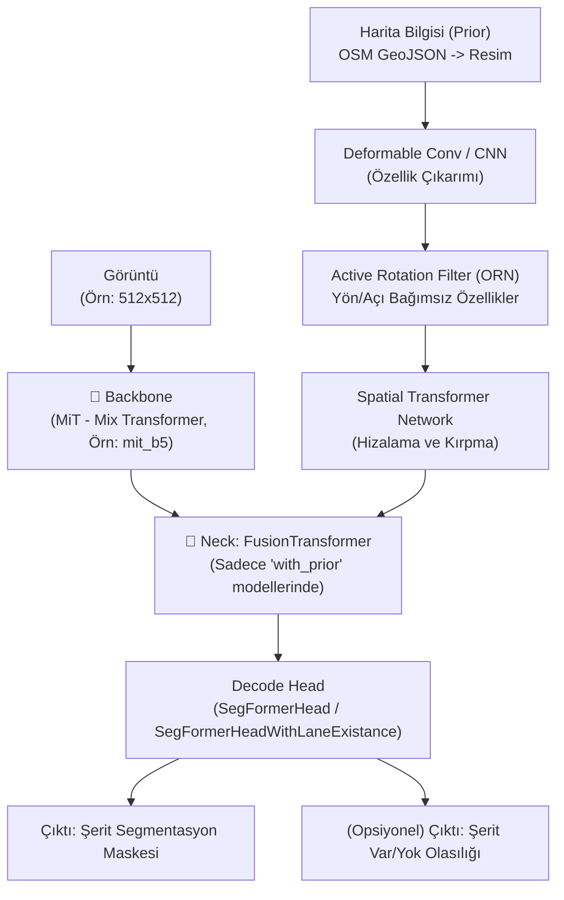

# PriorLane — Detaylı Modül Analizi

> **PriorLane: A Prior Knowledge Enhanced Lane Detection Approach Based on Transformer** (ICRA 2023)
> LSTR analizinde uyguladığımız 10 maddeli formata sadık kalınarak hazırlanmıştır. MMSegmentation ve SegFormer altyapılarını kullanır.

---

## Genel Mimari



---

## Katman Katman Modül Analizi

### 1. Giriş Noktaları

| Dosya | Görev |
|-------|-------|
| `tools/dist_train_lane_detection_with_prior.sh` | Dağıtık Pytorch eğitimini başlatır. |
| `local_configs/priorlane/...` | Tüm model hiperparametreleri ve yapılandırma dosyaları |
| `mmseg/models/segmentors/` | Modelin baştan sona (Encode-Decode) akışını yönetir. |

---

### 2. Config Sistemi — `local_configs/priorlane/...`

Tamamen **MMSegmentation Config** altyapısını kullanır. Kalıtımsal (`_base_ = [...]`) Python dosyalarından oluşur.

- Modeller kendi içinde ikiye ayrılır:
  1. **MiT-Lane** (Prior bilgisi *olmayan*, salt kamera tabanlı `tusimple.py` / `culane.py`)
  2. **PriorLane** (Önsel harita bilgisini kullanan `zjlab_with_prior.py`)

**Kritik Değerler (PriorLane için):**
- `backbone`: `mit_b5` (Mix Transformer B5)
- `neck`: `FusionTransformer` (Harita bilgisini entegre eden yaka modülü)
- `decode_head`: `SegFormerHead` (Prior varsa) veya `SegFormerHeadWithLaneExistance` (Prior yoksa)

---

### 3. Model Giriş Noktası — `mmseg/models/segmentors/encoder_decoder.py`

Standart MMSegmentation `EncoderDecoder` sınıfıdır. LSTR'nin aksine tüm kodu manuel yazmak yerine MMLab kütüphanelerine yaslanır. Görüntüyü alır, `extract_feat()` ile backbone ve neck'ten geçirir, ardından `_decode_head_forward_train()` ile maske ve kayıpları hesaplar.

---

### 4. Backbone — Mix Transformer (MiT)

Modelin can damarı **SegFormer**'ın kemiği olan **Mix Transformer (MiT)** (örn: `mit_b5`). ResNet yerine Transformer blokları kullanır.
LSTR'ın CNN tabanlı omurgasının aksine, MiT baştan sona dikkat (attention) mekanizmalarıyla 4 aşamalı (1/4, 1/8, 1/16, 1/32) hiyerarşik özellik haritaları çıkarır. LSTR'deki CNN + Transformer yapısından ziyade **Tam Transformer (Vision Transformer türevi)** yaklaşımını benimser.

---

### 5. Position Encoding — Örtülü (Implicit) / Overlapped Patch Dönüşümü

Standart sinüzoidal pozisyon kodlaması (Sine Position Encoding - LSTR'de kullanılan) yerine, MiT'in kendi içindeki 3x3 **Overlapped Patch Merging** (Örtüşen Yama Birleştirme) konvolüsyonlarını kullanır. Bu evrişimler, Zero-Padding sayesinde modelin konum bilgisini örtülü (implicit) olarak öğrenmesine izin verir.

---

### 6. Neck — `FusionTransformer` (Harita Bilgisi Entegrasyonu)

Burası PriorLane'in makalesine adını veren **en özgün** kısmıdır:
Eğer OpenStreetMap tabanlı bir harita resmi sağlanmışsa:

1. **Özellik Çıkarımı**: Harita `DeformableConv2d` veya standart evrişimle (`patch`) vektörleşir.
2. **Yön/Açı Bağımsızlığı (ORN)**: Arabanın harita üzerindeki rotasyonu farklı olabileceği için `ORConv2d` (Active Rotation Filter) ve `RotationInvariantPooling` kullanılarak özellikler açıdan bağımsız hale getirilir.
3. **Mekansal Hizalama (STN)**: `Spatial Transformer Network` haritayı kameranın bakış açısıyla hizalamak için projektif bir afin dönüşüm öğrenir.
4. **Çapraz Dikkat (Cross-Attention)**: Hizalanmış harita `query` olarak, Kameradan gelen resim (Backbone C4) `key/value` olarak Transformer katmanına girer ve birbirini zenginleştirerek tek bir özellik haritası üretilir.

---

### 7. Prediction Heads — `SegFormerHead` / `SegFormerHeadWithLaneExistance`

LSTR'ın aksine regresif eğriler (polinom katsayıları) değil, MASK (Segmentasyon) üretir. Parametrik değildir, pikselseldir.

**A. MLP Decoder (SegFormerHead)**
Backbone'dan gelen 4 seviyeli özellikleri (C1, C2, C3, C4) alır:
- Her biri basit bir `MLP` (Linear Layer) katmanına sokularak hepsinin kanal sayısı eşitlenir (Örn: 768 / 128 kanal).
- Küçük haritalar bilineer interpolasyonla büyütülerek (upsample) C1'in (1/4 scale) boyutuna getirilir.
- Dördü `Concat` ile birleştirilir.
- 1x1 ConvLayer (`linear_fuse`) ile maske sınıflarına (`num_classes`) dönüştürülür.

**B. Auxiliary Head (LaneExist)**
Eğer prior yoksa (`MiT-Lane`), model SegFormer head'ine ek bir `LaneExist` dalı ekler.
- Global Average Pooling -> `Linear` -> `Linear` -> `Sigmoid` adımlarından geçerek *Hangi şeritlerin resimde var olduğu* ihtimalini (var/yok classification) bulur.

---

### 8. Loss Sistemi — Cross Entropy Loss

Maske tahmini yaptığı için Hungarian Matching (Bipartite Matching), L1 Loss veya Focal Loss'a ihtiyaç duymaz. Sınıflandırma problemi gibi değerlendirilir:
- **`CrossEntropyLoss`**: Modifiye edilmiş weights ile asimetrik uygulanır (Örn: Arka plan ağırlığı: 0.1, Şerit ağırlıkları: 1.0).
- Ek olarak LaneExist dalı (varsa) için klasik **BCE** (Binary Cross Entropy) hesaplanır. Eğitimi stabilize eder.

---

### 9. Dataset Pipeline — (Önsel Bilgi Üretimi)

Makaledeki Custom veriseti için oldukça özgün bir ön-işleme (pre-processing) tanımlıdır (`README.md`):
1. **OSM İndirme**: Open Street Map (OSM) geojson verisi alınır.
2. **Kuşbakışı Render (Python-OpenCV)**: Yollar bir `global_image` içine beyaz çizgiler olarak çizilir.
3. **Kesme & Döndürme (`get_local_prior`)**: GPS/UTM koordinatlarına bakılarak ortadaki çember harita (100x100) kesilir ve model rotasyona invariant (bağımsız) olsun diye rastgele açılarda çevrilip DataLoader'a verilir.

*(TuSimple ve CULane eğitimlerinde bu harita aşaması atlanır, klasik MMSegmentation loader'ı çalışır).*

---

### 10. Training & Evaluation Pipeline — MMSeg Engine

MMLab ekosistemi kullanıldığından yapı LSTR'dan çok daha yüksek seviyelidir. `AdamW` optimize edicisi ve `poly` (polinomsal öğrenme oranı azaltımı) tercih edilmiştir. 
Değerlendirme (Evaluation) adımında, MMSegmentation test döngüsü çalıştırılır ve sonrasında şeritlerin resimde bulunup bulunmadığına ilişkin çıktılar `.json` / `.txt` olarak kaydedilip CULane veya TuSimple'ın resmi C++ eval fonksiyonlarına yönlendirilir.

---

## Tüm Veri Akışı Özetle:

```
KAMERA (Resim) → MiT Backbone (Transformer) ───┐
                                               ▼
HARİTA (Prior) → ORConv + STN (Rotasyon & Hizalama) → FusionTransformer (Cross Attn)
                                               ▼
                            MLP Decoder (SegFormer Decode Head)
                                               ▼
                           (1) Şerit Olasılıkları Çıktısı (Var/Yok)
                           (2) Pikselsel Şerit Segmentasyon Maskesi
```
