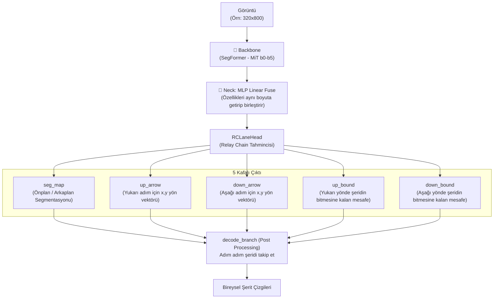

# RCLane — Detaylı Modül Analizi

> **RCLane: Relay Chain Prediction for Lane Detection** (ECCV 2022)
> Şeritleri "bayrak yarışı" (relay chain) mantığıyla, ileri-geri adım atan yön okları halinde tahmin eden, MindSpore tabanlı yepyeni bir mimari.

---

## Genel Mimari



---

## Katman Katman Modül Analizi

### 1. Giriş Noktaları

| Dosya | Görev |
|-------|-------|
| `train.py` | MindSpore eğitim döngüsü ve MindRecord veri hazırlığı |
| `src/rclane/rclane.py` | Ana model sınıfı (`RCLane`) |
| `src/lane_codec.py` | Ground truth şeritlerinin (Relay Chain) üretimi ve test edilecek şeritlerin çıkartılması. |

---

### 2. Config Sistemi — `default_config.yaml` / `config.py`

Derin, hiyerarşik veya MMDetection tarzı modüler Python config yerine daha basit bir `.yaml` tabanıyla beslenir.
**Kritik Değerler**:
- `image_width: 1640`, `image_height: 590` (Orijinal Çözünürlük)
- `resize_width: 800`, `resize_height: 320` (Model Girişi)
- `seg_threshold: 0.5`: Arka plan/Ön plan ayrımında şerit tespit barajı.
- `step_length: 10`: Relay Chain algoritmasında her bir sıçramanın (ok atlamasının) piksel uzunluğu.

---

### 3. Model Giriş Noktası — `src/rclane/rclane.py` (`RCLane`)

LSTR veya PyTorch projelerinin aksine Model, `nn.Cell` (MindSpore'un `nn.Module` karşılığı) sınıfından türer.
Bölümleri: `vision` (örn SegFormer kalibresi), `embedding_dim`, `middle_dim`. İleri akışında sadece Backbone -> Head -> Loss fonksiyonları koşar.

---

### 4. Backbone — `src/rclane/segformer.py` (Mix Transformer)

Model özellikleri çıkarmak için **SegFormer**'ı (MiT: Mix Transformer b0'dan b5'e) omurga olarak kullanır. 
- ResNet'ten ziyade, özellikler hiyerarşik Transformer katmanlarından elde edilir. 
- Çözünürlük seviyeleri: C1 (1/4), C2 (1/8), C3 (1/16), C4 (1/32).

---

### 5. Position Encoding

Yine SegFormer kullandığı için dışarıdan 2D Sine Pozisyon kodu eklemez (LSTR'den farkı). Mix Transformer, katmanlar arasındaki "Overlapped Patch Merging" bloklarındaki stride evrişimlerinin Zero-Padding yapısı sayesinde mekansal konumu örtülü (implicit) olarak modele kazandırır.

---

### 6. Neck (FPN) — `MLP Linear Fuse`

Özellik Piramidi çok basittir, tıpkı standart SegFormer Mimarisi gibidir:
- Dört seviyedeki haritanın da kanal sayısı `MLP` katmanlarıyla `embedding_dim`'e sabitlenir.
- Ardından küçük haritalar 1/4 (C1) seviyesine `Bilinear` olarak büyütülür (upsample).
- Hepsi `Concat` edilip (Birleştirilip), 1x1'lik bir Convolution'a (`linear_fuse`) sokulmak suretiyle çok katmanlı özellikler kaynaştırılır. LSTR gibi encoder-decoder karmaşası yoktur.

---

### 7. Prediction Heads — `RCLaneHead`

Ağın en can alıcı noktası budur. Model şablon (Anchor) veya Bipartite Matching fırlatmaz. 5 kafalı çıktıda her piksel uzaysal bir komutta bulunur:
1. **`seg_map` (2 Kanal)**: Bu piksel şerit mi, arka plan mı?
2. **`up_arrow` (2 Kanal)**: Şerit olan piksellerden, şeridin üst ucuna doğru `step_length` kadar adım atılsa X ve Y ofset vektörleri ne olmalıdır?
3. **`down_arrow` (2 Kanal)**: Aynı şekilde aşağı gitmek için X ve Y ofseti atılım vektörü.
4. **`up_bound` (2 Kanal)**: Şeridin bitimine (yukarı yönde) atılabilecek daha kaç "adım" (distance/step) kaldı?
5. **`down_bound` (2 Kanal)**: Şeridin kopacağı alt bitimine kaç "adım" atılabilir?

---

### 8. Loss Sistemi — `RCLaneLoss`

Tıpkı Pytorch gibi yazılmış bir MindSpore modülüdür. Sınıflandırma ve uzaysal Mesafe ayrı hedeflenir:
- **Segmentasyon:** `LogSoftmax` kullanılıp `CrossEntropy` yapılır. Şerit pikselleri az olduğundan **OHEM (Online Hard Example Mining)** ile arka plandan sadece zor piksellere ceza basılır (`NEGATIVE_RATIO = 15`).
- **Ok ve Sınır Kayıpları (Arrows & Bounds):** Vektörel mesafe çıktısıdır, `SmoothL1Loss` ile eğitilir. Yalnızca şerit tahmini yapılan `pmask` (pozitif bölgelerde) aktif edilir, boş yerlere Loss cezası gitmez.

---

### 9. Dataset Pipeline — (Relay Chain Formatına Kodlama) `lane_codec.py`

Veri ön işleme harikasıdır. 
- Normal x,y nokta dizisi label'larını alır ve 5 piksel kalınlığında renderlar.
- O kalın boyalı her şerit içi pikselden, şeridin doğrultusunda "10 çapındaki bir daireyi kestirip" (intersection), çıkılan yerin yön açısına göre bir Ok (dx, dy) vektörü atar. 
- Veriler I/O dar boğazını aşması için `create_mindrecord_dir` ile `.db` uzantılı Binary bir formata (MindRecord) çevrilerek tutulur.

---

### 10. Training Infrastructure

`train.py` içinde MindSpore platformu üzerinden çalışır. `device_target = Ascend` veya GPU seçeneği vardır. Graph_Mode kullanılarak Python kodu optimize C++ işlemlerine (JIT Compilation gibi) çevrilir. Dağıtık veri paralelleştirici (Data Parallel) mekanikleri kullanılır.

---

### 11. Evaluation Pipeline (Çıkarsama - `decode`)

Piksellerden tam teşekküllü Şerit elde etme oyunu gibidir:
1. Test edilen imajda pikseller aranır, segmentasyon barajını (0.5) aşanlara (tohum) oturulur.
2. Tohumun üzerinden, modelin ürettiği `up_arrow` ve `down_arrow` ok uzantıları kadar koordinat atlanır (Tavşan zıplaması).
3. Bu zıplama şeride izini bırakır, modelin söylediği `up_bound` / `down_bound` zıplama miktarı bitene dek zıplamaya devam edilir.
4. Son olarak bütün bu "sekans izleri" birleştirilir. Tıpatıp birbirinin aynısı şeritler, IoU temelli bir **NMS (Non-Maximum Suppression)** filtrelerecesinden elenerek tek ve kesin çizgilere dönüşür.

---

## Tüm Veri Akışı

```
Görüntü (3×H×W)
  → Backbone (SegFormer - MiT) ........................ 4 Ölçekli Çıktılar (C1, C2, C3, C4)
  → MLP Linear Fuse Neck .............................. Hepsini aynı boyuta eşitle + Birleştir
  ↓
  [RCLaneHead - 5 Farklı CNN Kafası]
  ├── seg_map (Var / Yok) ........................... (1, 2, H, W)
  ├── up_arrow (X,Y Ofsetleri) ...................... (1, 2, H, W)
  ├── down_arrow (X,Y Ofsetleri) .................... (1, 2, H, W)
  ├── up_bound (Kalan Uzunluk/Adım Tahmini) ......... (1, 2, H, W)
  └── down_bound (Kalan Uzunluk/Adım Tahmini) ....... (1, 2, H, W)
  ↓
[Eğitim] OHEM ile CrossEntropy Loss (Segmentasyon) + Şerit bölgelerinde L1 Loss (Oklar/Mesafe)
[Test] Segmentasyonu 0.5 olan pikselleri Tohum al → Okların atladığı doğrultu boyutu → 
       Tahmin edilen adım sınırına (Bound) kadar zincir gibi noktaları ekle → 
       Kesişen (Benzer) zincirleri NMS ile sustur → Nihai şerit listesine `.lines.txt` yaz.
```
