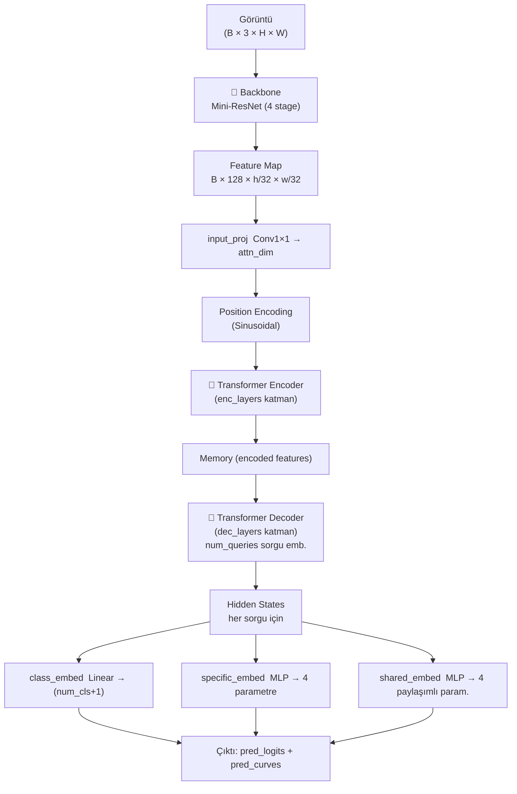

# LSTR — Detaylı Modül Analizi

> **Lane Shape Prediction with Transformers** (WACV 2021)  
> Toplam parametre: **765,787** | MACs: **577M** | CULane F-measure: **~0.64**

---

## Genel Mimari



---

## Katman Katman Modül Analizi

### 1. Giriş Noktaları

| Dosya | Görev |
|-------|-------|
| `train.py` | Eğitim döngüsü, LR schedule, snapshot kaydetme |
| `test.py` | Evaluation ve görselleştirme pipeline'ı |
| `config.py` | Global singleton `system_configs` nesnesi |

---

### 2. Config Sistemi — `config.py`

`Config` sınıfı tüm hiperparametreleri merkezi bir sözlükte tutar. JSON config dosyaları `update_config()` ile bu değerleri override eder.

**CULane için kritik değerler** (`config/LSTR_CULANE.json`):

| Parametre | Değer | Anlamı |
|-----------|-------|--------|
| `res_dims` | [16, 32, 64, 128] | Backbone kanal boyutları |
| `res_layers` | [1, 2, 2, 2] | Her stage'deki BasicBlock sayısı |
| `attn_dim` | 32 | Transformer hidden dim |
| `num_heads` | 2 | Multi-head attention başlık sayısı |
| `enc_layers` | 2 | Encoder katman sayısı |
| `dec_layers` | 2 | Decoder katman sayısı |
| `num_queries` | 7 | Tahmin edilecek şerit adayı sayısı |
| `dim_feedforward` | 128 | FFN ara katman boyutu |
| `lsp_dim` | 8 | Şerit parametresi boyutu |

---

### 3. Model Giriş Noktası — `models/LSTR_CULANE.py`

`model` ve `loss` sınıflarını tanımlar. `NetworkFactory` bu dosyayı dinamik olarak import eder (`importlib`).

```python
class model(kp):    # kp'den türer, config okuyup super().__init__() çağırır
class loss(AELoss): # SetCriterion ile Hungarian matching loss
```

---

### 4. Backbone — `models/py_utils/kp.py` → `kp` sınıfı

**Mini ResNet** — Orijinal ResNet18'den çok küçük, özel kanallarla:

```
Girdi (B, 3, 360, 640)
│
├─ Conv7×7, stride=2      → (B, 16, 180, 320)
├─ BN + ReLU + MaxPool    → (B, 16,  90, 160)
│
├─ layer1: 1× BasicBlock(16→16,  stride=1)  → (B,  16, 90, 160)
├─ layer2: 2× BasicBlock(16→32,  stride=2)  → (B,  32, 45,  80)
├─ layer3: 2× BasicBlock(32→64,  stride=2)  → (B,  64, 23,  40)
└─ layer4: 2× BasicBlock(64→128, stride=2)  → (B, 128, 12,  20)
```

> `FrozenBatchNorm2d` kullanılır (eğitim sırasında BN istatistikleri freeze).

**input_proj:** `Conv1×1(128 → attn_dim=32)` — transformer boyutuna düşürür.

---

### 5. Position Encoding — `models/py_utils/position_encoding.py`

**Sinusoidal 2D pozisyon kodlaması** (DETR'dan alınmış):
- Feature map'in her pozisyonuna `(x, y)` için sinüs/kosinüs tabanlı embedding eklenir
- Transformer'ın konumsal bilgi öğrenmesini sağlar

---

### 6. Transformer — `models/py_utils/transformer.py`

DETR'dan uyarlanmış encoder-decoder mimarisi:

#### Encoder
```
Her katmanda:
  ┌─ Self-Attention (q=k=src+pos_embed, v=src)
  ├─ Add & Norm
  ├─ FFN (Linear → ReLU → Linear)
  └─ Add & Norm
```
- Çıktı: `memory` `(HW × B × C)`
- Dikkat ağırlıkları döndürülür (görselleştirme için)

#### Decoder
```
Her katmanda:
  ┌─ Self-Attention (şerit sorguları arası)
  ├─ Add & Norm
  ├─ Cross-Attention (query=sorgu+query_pos, key=memory+pos)
  ├─ Add & Norm
  ├─ FFN
  └─ Add & Norm
```
- `num_queries=7` adet sıfır vektörü sorgu olarak başlar
- `return_intermediate=True` ise her decoder katmanından çıktı döner (aux_loss için)

---

### 7. Prediction Heads — `kp.py`

Her şerit sorgusu için **3 paralel çıkış kafası**:

```python
class_embed    = Linear(attn_dim, num_cls + 1)          # Sınıf skoru (şerit var/yok)
specific_embed = MLP(attn_dim, attn_dim, 4, mlp_layers)  # Şerite özgü 4 parametre
shared_embed   = MLP(attn_dim, attn_dim, 4, mlp_layers)  # Tüm şeritler için ortak 4 parametre
```

**Şerit Parametresi Formatı** (`pred_curves`, 8 boyutlu):

```
[lower, upper, k'', f'', m'', n', b'', b''']
   0      1     2    3    4    5   6    7
```

Şerit x koordinatı polinomla hesaplanır:
```
x(y) = k''/(y - f'')² + m''/(y - f'') + n' + b''·y - b'''
```

---

### 8. Loss Sistemi — `models/py_utils/`

#### `matcher.py` — HungarianMatcher
Tahminleri ground-truth şeritlerle **1-to-1 optimal eşleştirme** yapar (scipy `linear_sum_assignment`):

```
Cost = λ_cls · C_class + λ_curves · C_poly + λ_lower · C_lower + λ_upper · C_upper
```

| Ağırlık | Değer | Açıklama |
|---------|-------|----------|
| `loss_ce` | 3 | Sınıflandırma maliyeti |
| `loss_curves` | 5 | Polinom eğri maliyeti |
| `loss_lowers` | 2 | Alt sınır maliyeti |
| `loss_uppers` | 2 | Üst sınır maliyeti |

#### `detr_loss.py` — SetCriterion
Eşleştirme sonrasında kayıpları hesaplar:
- **`loss_labels`**: Cross-Entropy (eşleşmeyen sorgular → "no-object" sınıfı)
- **`loss_curves`**: Eşlenen sorgular için L1 polinom kaybı
- **`loss_cardinality`**: Tahmin edilen şerit sayısı kaybı (geri yayılmaz)

`aux_loss=True` ile ara decoder katmanlarından da kayıp hesaplanır.

---

### 9. Dataset Pipeline — `db/`

```
db/
├── detection.py     # Temel DETECTION sınıfı (soyut)
├── culane.py        # CULANE → CULane veri yükleyici
├── tusimple.py      # TUSIMPLE → TuSimple veri yükleyici
├── datasets.py      # {dataset_name: Class} sözlüğü
└── utils/
    ├── lane.py      # LaneEval: TuSimple metrik hesaplama
    └── metric.py    # eval_json yardımcı fonksiyonu
```

**CULANE veri akışı:**
```
list/*.txt → image path listesi
→ _extract_data() → ham şerit koordinatları
→ _transform_annotations() → normalize polinom formatına
→ pickle cache (./cache/culane_*.pkl)
→ DataLoader → model
```

---

### 10. Training Infrastructure — `nnet/py_factory.py`

`NetworkFactory` sınıfı her şeyi sarar:

```
NetworkFactory
├── model    = DummyModule(LSTR_CULANE.model())
├── loss     = LSTR_CULANE.loss()
├── network  = Network(model, loss)   # forward = model + loss
├── network  = DataParallel(network)  # çoklu GPU desteği
└── optimizer = Adam / SGD / AdamW
```

| Metod | Görev |
|-------|-------|
| `train()` | forward + backward + optimizer.step() |
| `validate()` | `torch.no_grad()` ile kayıp hesaplama |
| `test()` | Sadece model.forward() — kayıp yok |
| `load_params(iter)` | `cache/nnet/LSTR_CULANE/LSTR_CULANE_{iter}.pkl` yükle |
| `save_params(iter)` | Model ağırlıklarını kaydet |

---

### 11. Evaluation Pipeline — `lane_evaluation/`

CULane'in resmi C++ evaluator'ı:

```
test.py → .lines.txt dosyaları (results/LSTR_CULANE/500000/testing/)
       ↓
lane_evaluation/evaluate (C++ binary, OpenCV 4.x)
       ↓
tp/fp/fn sayımı (IoU threshold=0.5, lane width=30px)
       ↓
Precision / Recall / F-measure
```

---

## Tüm Veri Akışı

```
Görüntü (360×640×3)
  → Backbone (Mini-ResNet, 4 stage) ................ (B, 128, 12, 20)
  → Conv1×1 projeksiyon ............................ (B,  32, 12, 20)
  → Sinusoidal 2D Position Encoding
  → Transformer Encoder (2 katman, 2 head) ......... memory
  → Transformer Decoder (2 katman, 7 sorgu) ........ (B,  7, 32)
  ↓
  ┌── class_embed    → (B, 7,  2)   # şerit var/yok skoru
  ├── specific_embed → (B, 7,  4)   # per-lane polinom params
  └── shared_embed   → (B, 7,  4)   # paylaşımlı params (mean)
  ↓
pred_logits : (B, 7, 2)
pred_curves : (B, 7, 8)   [lower, upper, k'', f'', m'', n', b'', b''']
  ↓
[Eğitim]  Hungarian Matching → SetCriterion loss → backward
[Test]    x(y) = k''/(y-f'')² + ...  → .lines.txt → evaluate binary
```
